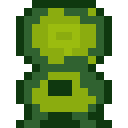
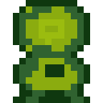
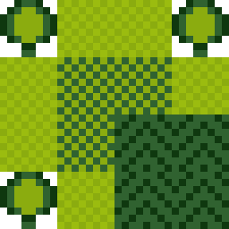
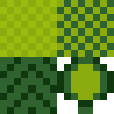
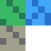
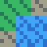

# Examples

Working scripts demonstrating pixlrt features. Each script runs against the local source and writes output files to this directory.

## Running an example

```bash
npm run build
npx tsx examples/basic-sprite.ts
```

---

## basic-sprite.ts

A 10×8 character sprite using a custom 5-color palette. Demonstrates PNG/SVG export and transforms (flip, scale).

| Output                            | File                            |
| --------------------------------- | ------------------------------- |
|                  | `hero.png`                      |
|  | `hero-flipped.png` — `.flipX()` |
|            | `hero-2x.png` — `.scale(2)`     |

---

## gameboy-sprites.ts

RPG sprites and a tileset scene using the built-in `gameboy` palette (4 shades of green).

| Output                                           | File                                                      |
| ------------------------------------------------ | --------------------------------------------------------- |
|                  | `gb-adventurer.png` — front-facing hero (16×16)           |
|  | `gb-adventurer-flipped.png` — `.flipX()`                  |
|                      | `gb-creature.png` — round collectible monster (16×16)     |
|      | `gb-creature-variant.png` — `.recolor()` ice variant      |
|                      | `gb-puffball.png` — platformer character (16×16)          |
|          | `gb-puffball-sheet.png` — 2-frame walk cycle sprite sheet |
|                    | `gb-overworld.png` — composed tile scene                  |
|                        | `gb-tileset.png` — full tileset sheet                     |

---

## animation.ts

A 5×6 walking character with 4-frame animation cycle exported as a sprite sheet.

| Output                        | File                                  |
| ----------------------------- | ------------------------------------- |
|  | `walk-sheet.png` — 4-frame walk cycle |

---

## tileset.ts

A 3-tile tileset (grass, water, stone) composed into a small scene with a sky-blue background.

| Output                  | File                               |
| ----------------------- | ---------------------------------- |
|  | `tileset.png` — tile library sheet |
|      | `scene.png` — composed scene       |

---

## game-sprites.ts

Demonstrates advanced features: `paletteSchema` for validated color sets, `template` for reusable sprite grids with named slots, `animateSlots` for keyframe animation, `shiftRows` for lean effects, and `silhouette` for white masks.

| Output                          | File                                      |
| ------------------------------- | ----------------------------------------- |
|              | `boss1.png` — red boss variant            |
|              | `boss2.png` — blue boss variant           |
|  | `bullet-mask.png` — white silhouette mask |
